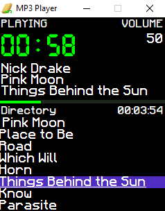
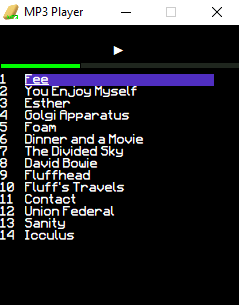
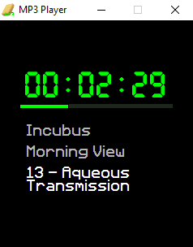

# SPONGE'S MP3 PLAYER
This is a fully functioning mp3 player originally intended to be put on a Raspberry Pi, but I've added support for desktop.
Essentially, it's a directory viewer but with the capability of playing mp3s.

## FEATURES
- Three unique views which display different information
- List-based UI which scans folders for mp3 files
- Music tagging support
- Display song artist/album/title when playing
- Dynamic UI changes
- Progressive bar which fills as the song continues
- Automatic album looping within a folder
### General View
- Shows you all available information
### List View
- Provides a zoomed-out version of the list on the general view
- Leftmost numbers show the track number on songs
- Rightmost numbers indicate how many files are inside a folder
### Minimal View
- Nice
- You can still do song-based controls in this view, like fast-forward, play/pause, skip, volume control, etc.
  
## INSTALLATION & USAGE
1. Run it in the command line with `python main.py`.

Or:
1. Build it by launching the `makefile.sh`. This will build an executable file using pyinstaller for ease of use. This should work for your OS.
2. Find the executable file in the `dist` folder.
3. Drag the file out of the folder, into a directory with mp3 files (or folders as albums).
4. Launch the file.
5. Enjoy your music.

### HOTKEYS
|Hotkey|Control|Hotkey|Control|
|------|-------|------|-------|
|q|View Switch|a|Rewind
|w|Back|s|Pause/Play|
|e|Select|d|Fast Forward|
|r|Navigate Up|f|Navigate Down|
|PageUp|Volume Up|PageDown|Volume Down|
|a + s|Previous/Beginning|s + d|Next|
|a + s + d|Stop|

## SCREENSHOTS

